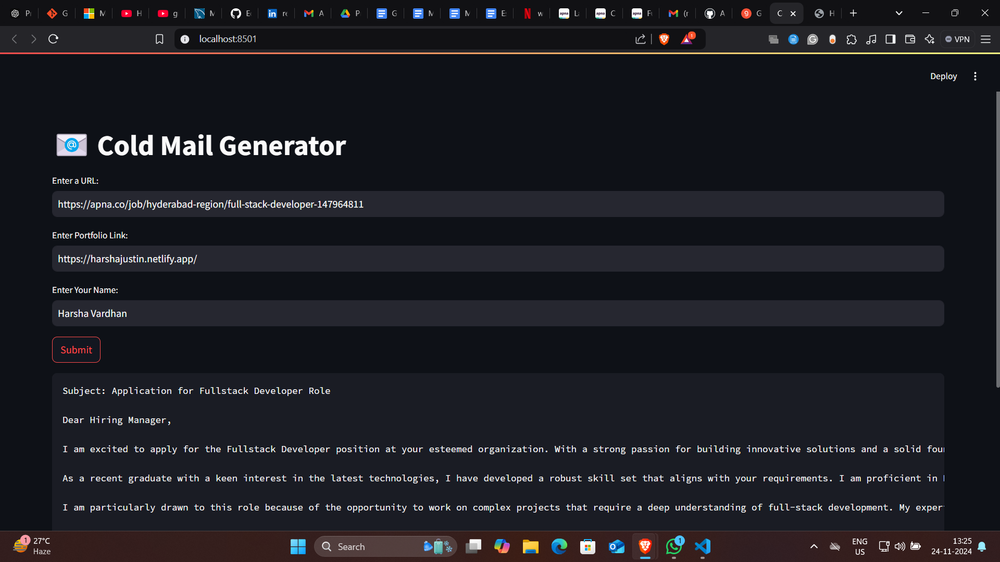
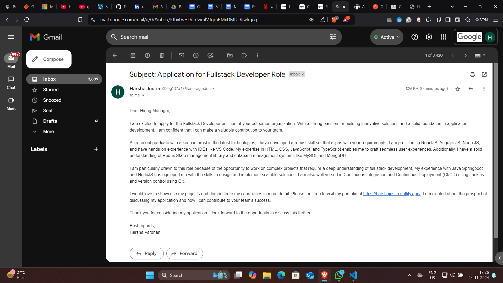

# 📧 Cold Email Generator Using LangChain Framework with Grok API Integration
This project leverages the LangChain framework to generate personalized cold emails and integrates with the Grok API for efficient handling of email data and automation of workflows. The application creates tailored email content for job applications, business outreach, or any context where personalized communication is needed.

**Key Features:**
- Dynamic Email Generation: Powered by LangChain's NLP capabilities, the tool creates context-aware email content based on the job description and recipient details.

- Grok API Integration: Manages email-specific workflows and enhances operational efficiency.

- Personalization: The emails can include personalized content, such as portfolio links, relevant job details, and more, for a more engaging communication experience.

- Customizable Templates: The system supports customizable email formats, making it ideal for lead generation, partnership proposals, or follow-ups.

- Automated Outreach: Reduces manual intervention by automating the email crafting process, saving time and ensuring timely communication with potential clients.

**Technologies Used:**
- LangChain Framework: Used for creating dynamic and context-aware email content using NLP techniques.

- Grok API: Provides backend capabilities for managing email workflows, storing relevant data, and optimizing email interactions.

- Python & Streamlit: Python is used for backend development, while Streamlit powers the interactive web interface for users to generate cold emails.







**Set-up Instructions:**
1. Obtain Grok API Key
To get started, you will need an API key from Grok. Follow these steps:

- Visit Grok API Keys to create and obtain an API key,get an API_KEY from here: https://console.groq.com/keys.
- In your project folder, navigate to the .env file and update it with your API key:
Grok_API_KEY=<your-api-key>


2. Create a virtual environment:
    ```commandline
    python -m venv .venv
    ```
3. Activate Virtual environment:
    ```commandline
    .venv\Scripts\activate
    ```
  
3. Install the required libraries and dependencies by running the following command in your terminal:
    ```commandline
     pip install -r requirements.txt
    ```
4. After setting up the environment and installing dependencies, you can launch the app with this command:
   ```commandline
   streamlit run main.py
   ```

This will open the application in your browser where you can begin generating cold emails.

**Use Cases:**
- Job Seekers: Allows individuals to generate personalized cold emails for job applications based on job descriptions from company career pages, with the option to include portfolio links.
- Marketing Professionals: Automates the process of creating personalized emails for various outreach campaigns, saving time and effort in crafting each email manually.
